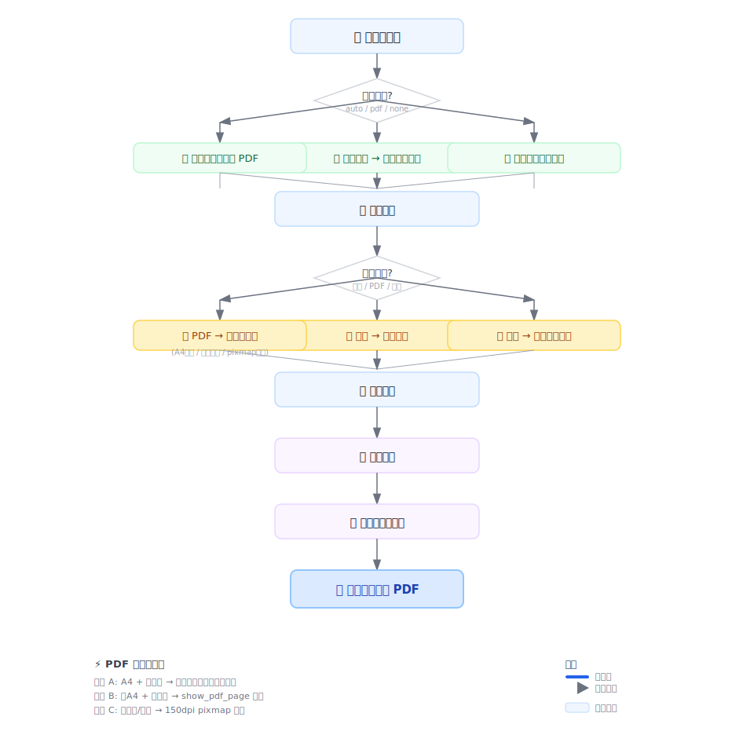

<p align="center">
  
  
  
</p>

<h1 align="center">Diligence PDF</h1>
<p align="center"><strong>散落文档一口吞 —— 自动建索引、统一边距、直接送印</strong></p>

<p align="center">
  <a href="#-快速开始">快速开始</a> ·
  <a href="#-适用场景">适用场景</a> ·
  <a href="#-ai-agent-支持">AI Agent</a> ·
  <a href="#-安全">安全</a> ·
  <a href="#-安装">安装</a> ·
  <a href="#-许可">许可</a>
</p>

<p align="center">
  
</p>

---

## 这是什么

**想象一下：** 项目大功告成，只剩最后一哆嗦——把前期攒下的一堆文件汇总打印出来。就这么一个活，干起来还是好麻烦：照片歪的、扫描件横的、PDF 尺寸五花八门，最关键的是——这些文件你当时是按自己才看得懂的结构放的，过两天自己都会懵："这块我当时是怎么放的来着？"

**Diligence PDF 就是为这最后一公里设计的。** 你只管按自己的习惯随便放，把根目录指给它，它自己进去翻——认得出你的结构、理得清你的文件、给每一页裁好统一边距、标上页码、生成目录书签。最后递到你手上——一本干干净净、可以直接送印的 PDF。

> *"帮我整理一下这个文件夹"* —— 就这一句话的事，三分钟拿成品。

---

## 🎯 适用场景

不管是哪个行业、哪种材料，只要你有"把一堆零散文件变成一本规范 PDF"的需求，它都能用。**所有输出均自动附带：层级索引 + 可折叠书签 + 全局页码 + 18mm 统一页边距。**

| 场景 | 你手头有什么 | 最终得到什么 |
|------|-------------|-------------|
| **法律尽调** | 营业执照、章程、凭证扫描件、投资证书 | 一本排版整齐的尽调底稿 |
| **财务审计** | 发票、银行回单、合同、对账单 | 一本可直接归档的审计底稿 |
| **合规审查** | 许可证、批复文件、内部制度、合规报告 | 一本便于翻阅的合规档案 |
| **项目归档** | 设计图纸、验收单、会议纪要 | 一本规范整洁的竣工档案 |
| **学术研究** | 问卷、原始数据扫描件、文献摘录 | 一本印刷友好的研究材料 |
| **招投标** | 资质证书、业绩证明、财务报表 | 一本让评委眼前一亮的投标合订本 |

<details>
<summary>📊 有它 vs 没它</summary>

| 😫 以前 | 😎 现在 |
|---|---|
| 手动打开每个文件，旋转、调尺寸 | 工具自动检测横纵，一键适配 |
| 文档贴边打印，切掉一半内容 | 统一 18mm 边距，安全出纸 |
| 翻几百页找文件，全靠肉眼扫 | 书签导航 + 目录索引，秒级跳转 |
| 一下午拼一本，拼完发现页码乱了 | 三分钟自动完成，页码一字不差 |
| 换台电脑、换个项目得重新来一遍 | 一条命令，知识库、审计稿、标书全搞定 |

</details>

## ✨ 它为你做了什么

| 🧠 能力 | 💬 说人话 |
|---------|----------|
| **🔍 自动索引** | 不用手写目录，扫一眼文件夹结构，自动生成层级索引页 |
| **📑 PDF 书签** | 哪怕一千六百页，左边书签一点就到，比翻纸质书还快 |
| **🖼️ 智能包裹** | 图片不切不拉伸，PDF 自动选最好的方式放进去——不糊、不歪、不缺 |
| **📐 打印就绪** | 18mm 页边距护体，横页竖页自动适配，送到文印室直接开打 |
| **⚡ 快路径优先** | 95% 的页面走"激光打印"级别的高清矢量路径，实在不行才降级保底 |

## 📦 安装

```bash
pip install git+https://github.com/bangchuiLee/diligence-pdf.git
```

或本地克隆：

```bash
git clone https://github.com/bangchuiLee/diligence-pdf.git
cd diligence-pdf
pip install .
```

依赖：

| 包 | 版本 | 用途 |
|----|------|------|
| PyMuPDF | ≥1.24 | PDF 渲染/拆分 |
| reportlab | ≥4.0 | 索引页 + 页码生成 |
| pypdf | ≥5.0 | PDF 合并 + 书签 |
| Pillow | ≥10.0 | 图片处理 |
| openpyxl | ≥3.1 | xlsx 索引读取 |

## 🚀 快速开始

### 零配置 — 自动索引

```bash
diligence-pdf assemble ./我的材料 -o 归档文件.pdf
```

跑起来之后，你会看到：

```
$ diligence-pdf assemble ./底稿材料 -o 尽调底稿.pdf

╭──────────────────────────────────────────────────╮
│  Diligence PDF v1.0                               │
│                                                    │
│  📂 输入目录   ./底稿材料                           │
│  🔍 索引模式   自动扫描目录生成索引                  │
│  📑 索引条目   52                                   │
│  📄 找到文件   142 个 (图片 89 + PDF 53)            │
│                                                    │
│  [████████████████████] 100% (142/142)              │
│                                                    │
│  ✅ 处理完成   耗时 2 分 18 秒                       │
│  📏 总页数     1,696 页                             │
╰──────────────────────────────────────────────────╯
```

<p align="center">
  
</p>

输入目录结构：

```
项目文档/
  ├── 01-公司设立/
  │   ├── 营业执照.jpg
  │   ├── 章程.pdf
  │   └── 股东名册/
  │       └── ...
  ├── 02-历次变更/
  └── ...
```

目录名自动成为索引标题，子文件夹二级索引。输出一份带书签、页码、统一边距的 PDF。

### Python API

```python
from diligence_pdf import assemble

assemble({
    "input_dir": "/path/to/documents",
    "output_path": "/path/to/output.pdf",
    "index_mode": "auto",       # auto / pdf / none
    "image_mode": "fit",        # fit（等比） / split（长图切分）
    "add_bookmarks": True,
    "add_page_numbers": True,
})
```

### 预转换索引 PDF

```python
assemble({
    "input_dir": "/path/to/documents",
    "output_path": "/path/to/output.pdf",
    "index_mode": "pdf",
    "index_source": "/path/to/index.pdf",
})
```

## 🔧 PDF 包裹决策树

```
输入 PDF 页面
  │
  ├─ A4 + 有边距 + 无旋转异常 → 原样通过（矢量、零开销）
  │
  ├─ 近 A4 + 无旋转异常 → show_pdf_page 矢量包裹（快）
  │
  └─ 非标准尺寸 或 旋转异常 → 150dpi pixmap 渲染（可靠回退）
```

## 🤖 AI Agent 支持

本工具设计为 **纯 Python 函数 + CLI**，不依赖特定框架，任何能执行 Python 代码的 AI Agent 均可直接调用。

| Agent / 平台 | 使用方式 |
|---|---|
| **Claude Code** | `pip install .` 后直接 `from diligence_pdf import assemble` |
| **Claude Desktop (MCP)** | 通过 Python 脚本 MCP Server 暴露 `assemble()` 为 tool |
| **OpenAI Codex CLI** | 支持 `pip install` + 函数调用，自动发现 API |
| **ChatGPT (Code Interpreter)** | 上传 whl 或 pip install git+URL，沙箱内直接 import |
| **Cursor / Windsurf** | 环境内 pip install 后即可在对话中调用 |
| **Aider** | 支持任意 Python 模块导入，无需额外适配 |
| **Gemini CLI** | 标准 Python 包，`pip install` 后 import 即用 |
| **GitHub Copilot Coding Agent** | 安装后自动补全建议 `assemble()` 调用 |
| **Devin** | 标准 pip 安装，可在 task 中调用 |

> **关键设计**：入口函数 `assemble(config: dict) -> str` 接受纯字典参数，无类型注解依赖、无异步操作、无状态副作用。任何 Agent 只需构造一个 dict 即可调用。

## 🔒 安全

### 零网络承诺

本工具**完全本地运行**。不会、也不需要发起任何网络请求：

- ❌ 无 API 调用
- ❌ 无遥测 / 埋点
- ❌ 无数据上传
- ❌ 无凭据存储
- ❌ 无第三方服务依赖

你可以断网运行，抓包验证，审计源码——总共 1200 行 Python，无混淆、无动态执行。

### 依赖审计

| 依赖 | 许可证 | 下载量 |
|------|--------|--------|
| PyMuPDF | AGPL | 50M+ |
| reportlab | BSD | 30M+ |
| pypdf | BSD | 80M+ |
| Pillow | HPND-C | 500M+ |
| openpyxl | MIT | 200M+ |

所有依赖均为 PyPI 官方包，许可证均允许本地使用。

> ⚠️ **注意**：PyMuPDF 使用 AGPL v3。本地 CLI / AI Agent 调用不触发 copyleft 条款。如需商用 SaaS 部署（网络分发），请替换为纯 pypdf 方案或咨询法律顾问。

## ⚙️ 完整配置

| 参数 | 类型 | 默认值 | 说明 |
|------|------|--------|------|
| `input_dir` | Path | 必填 | 底稿根目录 |
| `output_path` | Path | 必填 | 输出 PDF 路径 |
| `index_mode` | str | `auto` | `auto` / `pdf` / `none` |
| `index_source` | Path | — | 索引 PDF（`pdf` 模式） |
| `image_mode` | str | `fit` | `fit`（等比缩放）/ `split`（长图切分） |
| `add_bookmarks` | bool | `true` | PDF 书签 |
| `add_page_numbers` | bool | `true` | 页码 |
| `include_tables` | bool | `false` | 尝试处理 xls/xlsx |

## 📄 许可

Apache License 2.0 — 详见 [LICENSE](./LICENSE)

---

<p align="center"><sub>Built for anyone who needs their scattered documents compiled into a single, print-ready PDF — not patched together by hand.</sub></p>
